# InstaMeet 🎥

InstaMeet is a full-stack video meeting application for creating and joining
real-time meeting rooms with audio, video, screen sharing, chat, participant
presence, and guest access. 🚀

It uses a React/Vite frontend, an Express and Socket.IO backend, WebRTC for
peer-to-peer media, and MongoDB for storing users and meeting records. ⚡

## Live Demo 🌐

[https://instameet.debarghya.org](https://instameet.debarghya.org)

## Motivation 💡

InstaMeet was built to create a simple, fast, and accessible video meeting
experience where users can start a room, invite others, and collaborate without
extra setup. The project focuses on learning and implementing real-time
communication concepts such as WebRTC media streaming, Socket.IO signaling,
meeting-room state management, guest access, and secure user authentication.

## Features ✨

- 🔐 User registration and login
- 👤 Guest meeting access without authentication
- 🎥 Real-time audio and video meetings
- 🖥️ Screen sharing support
- 💬 In-room live chat
- 👥 Participant presence panel
- 🎙️ Active speaker highlighting
- 🔇 Microphone mute and unmute controls
- 📷 Camera on and off controls
- 🧾 Create and join meetings with custom room IDs
- 📋 Copy room ID from the meeting info panel
- 🧑‍💼 Host-aware meeting lifecycle and room cleanup
- 🌐 STUN/TURN configuration support for WebRTC connectivity
- 📱 Responsive UI for desktop and mobile screens
- ⚠️ Friendly camera, microphone, and screen-sharing error messages

## Architecture 🏗️

InstaMeet follows a full-stack client-server architecture with real-time
communication support.

### Simple Architecture

```text
React + Vite Frontend
        |
        | REST API requests + Socket.IO events
        v
Express Backend API
        |
        | Auth, meeting routes, room state, chat, WebRTC signaling
        v
MongoDB + WebRTC + STUN/TURN
```

### Visual Flow Architecture

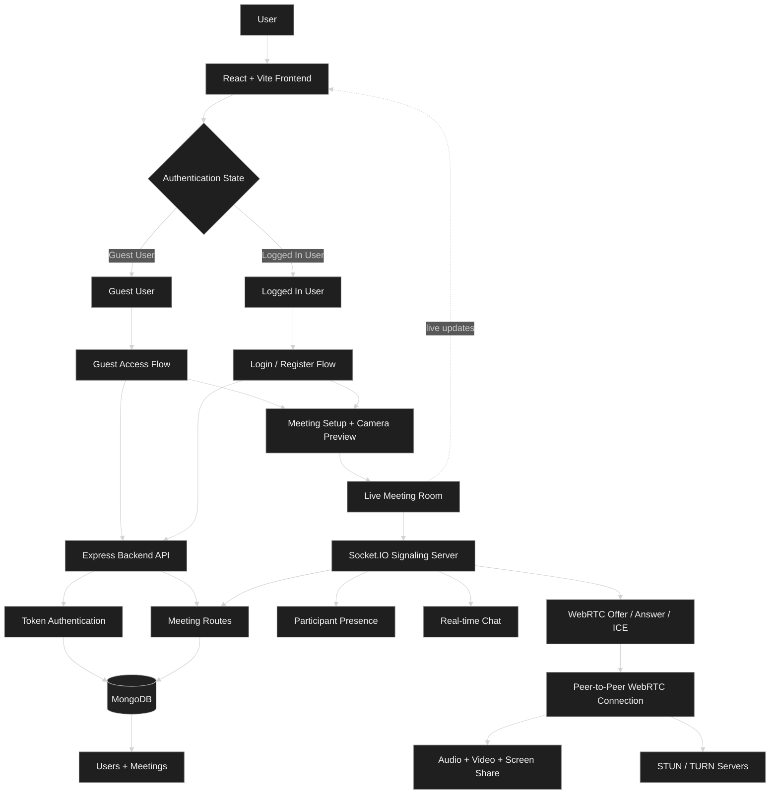

- **Frontend:** React, Vite, React Router, WebRTC browser APIs, and
  Socket.IO client.
- **Backend:** Node.js, Express, Socket.IO, Mongoose, and custom token-based
  authentication.
- **Database:** MongoDB stores registered users and meeting records.
- **Real-time layer:** Socket.IO manages room events, chat, participant state,
  and WebRTC signaling.
- **Media layer:** WebRTC handles peer-to-peer audio, video, and screen-sharing
  streams using configured STUN/TURN servers.

## Folder Structure 📁

```text
instameet/
├── backend/
│   ├── controllers/
│   │   ├── SocketManager.js
│   │   └── UserController.js
│   ├── model/
│   │   ├── MeetingSchema.js
│   │   └── UserModels.js
│   ├── routes/
│   │   └── UsersRoutes.js
│   ├── utils/
│   │   └── auth.js
│   ├── app.js
│   ├── index.js
│   ├── package.json
│   └── .env.example
│
├── frontend/
│   ├── public/
│   │   ├── favicon.svg
│   │   └── icons.svg
│   ├── src/
│   │   ├── assets/
│   │   │   ├── optimized/
│   │   │   ├── landing-page.jpg
│   │   │   └── logo.svg
│   │   ├── components/
│   │   │   └── Toast.jsx
│   │   ├── pages/
│   │   │   ├── Authentication.jsx
│   │   │   ├── Guestpage.jsx
│   │   │   ├── Landing.jsx
│   │   │   └── VideoMeet.jsx
│   │   ├── roomcomponent/
│   │   │   ├── MeetingScreen.jsx
│   │   │   ├── RoomChat.jsx
│   │   │   ├── RoomInfo.jsx
│   │   │   ├── RoomPage.jsx
│   │   │   └── RoomPresence.jsx
│   │   ├── utils/
│   │   │   ├── mediaErrors.js
│   │   │   └── session.js
│   │   ├── App.jsx
│   │   ├── config.js
│   │   └── main.jsx
│   ├── index.html
│   ├── package.json
│   ├── vercel.json
│   ├── vite.config.js
│   └── .env.example
│
├── README.md
└── .gitignore
```

## Database Design 🗄️

InstaMeet uses **MongoDB** with **Mongoose** to store registered users and
meeting room records.

### User Collection

Stores account details and the latest authentication token for a registered
user.

| Field | Type | Description |
|---|---|---|
| `_id` | ObjectId | Unique MongoDB user ID |
| `name` | String | User's display name |
| `username` | String | Unique lowercase username |
| `password` | String | Hashed password |
| `token` | String | Latest generated auth token |
| `createdAt` | Date | User creation timestamp |
| `updatedAt` | Date | Last update timestamp |

### Meeting Collection

Stores meeting room records and connects each room to its host user.

| Field | Type | Description |
|---|---|---|
| `_id` | ObjectId | Unique MongoDB meeting ID |
| `userId` | ObjectId | Reference to the host user |
| `meetingCode` | String | Unique room/meeting code |
| `createdAt` | Date | Meeting creation timestamp |
| `updatedAt` | Date | Last update timestamp |

### Relationship

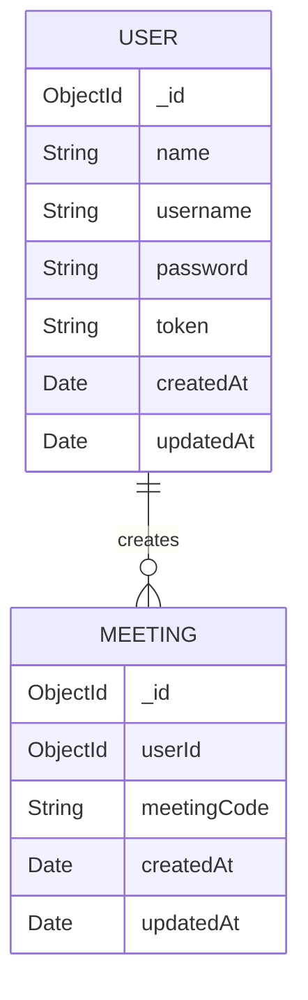

```text
User
  |
  | one user can create many meetings
  v
Meeting
```

- `Meeting.userId` references `User._id`.
- `User.username` is unique and stored in lowercase.
- `Meeting.meetingCode` is unique to prevent duplicate room IDs.
- Guest meetings are linked to a shared guest user record.

## Screenshots 📸

### Landing Page

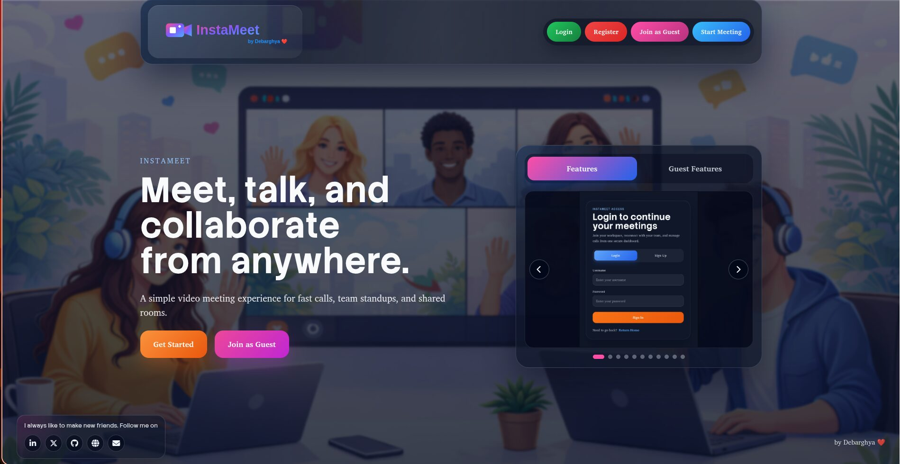

### Main App Flow

| Preview | Preview |
|---|---|
| 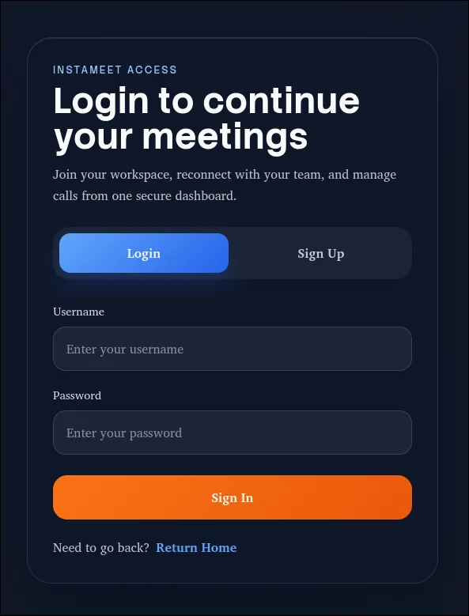 | 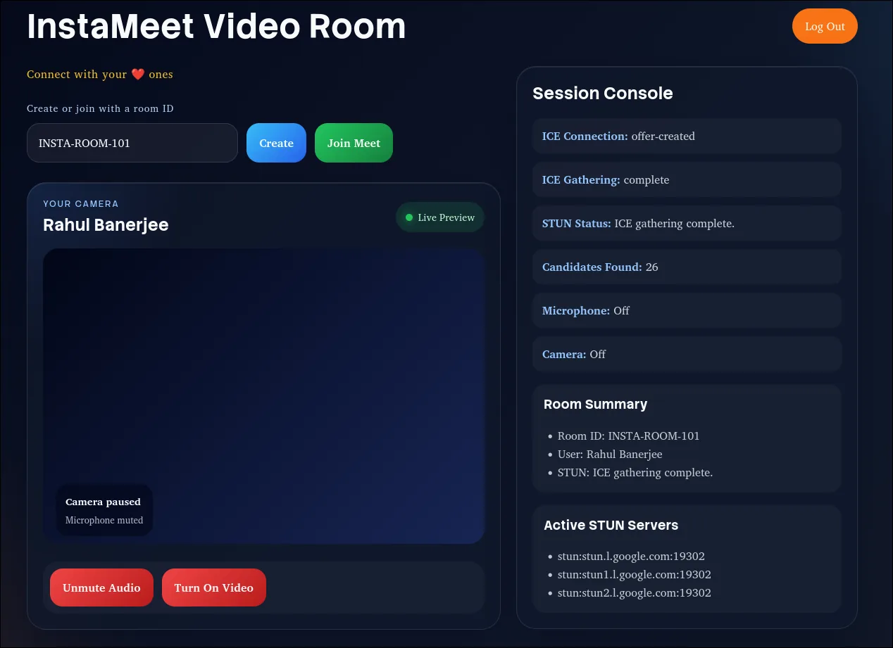 |
| 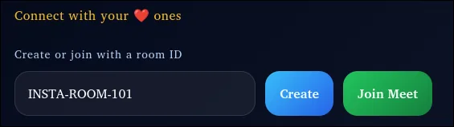 | 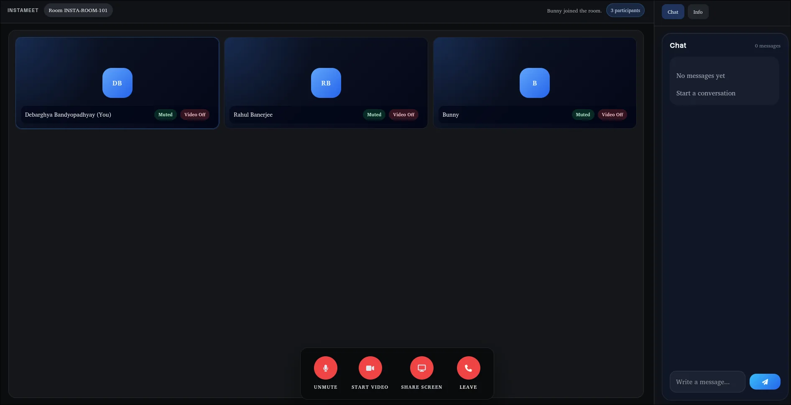 |
| 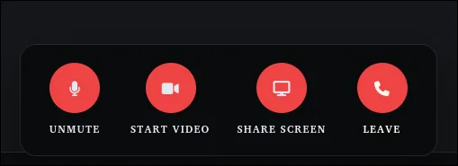 | 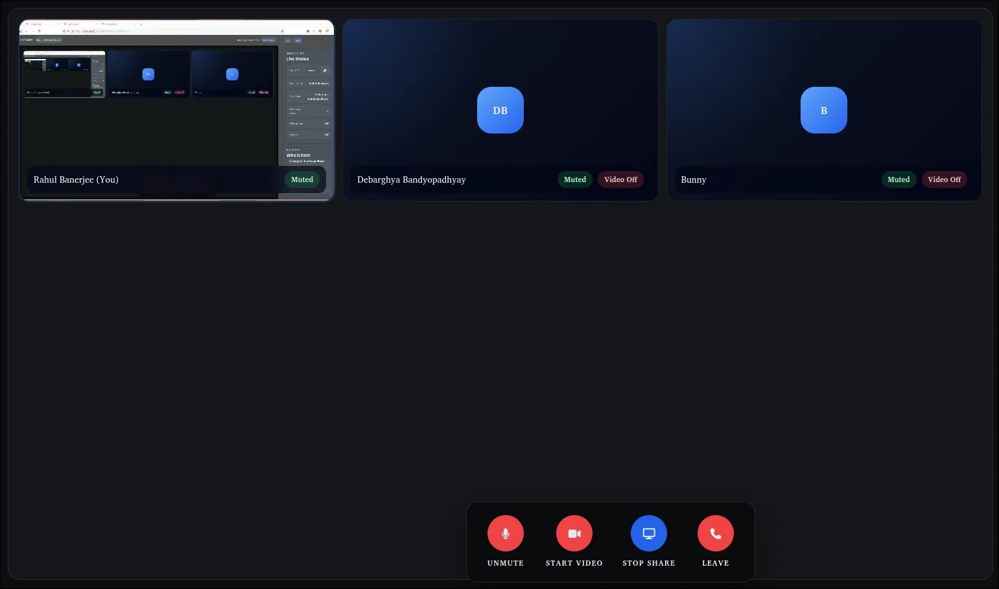 |
| 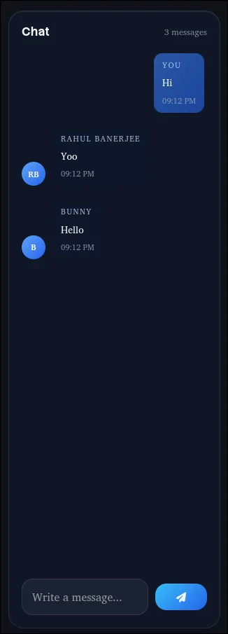 | 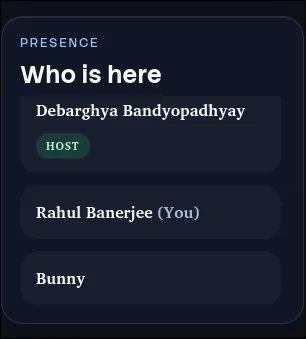 |
| 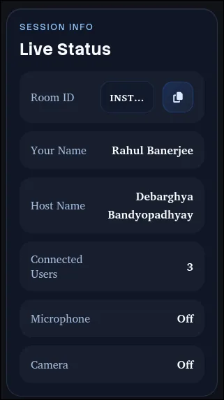 | 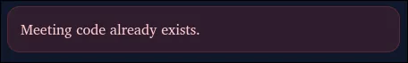 |
| 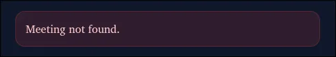 |  |

### Guest Flow

| Preview | Preview |
|---|---|
|  | 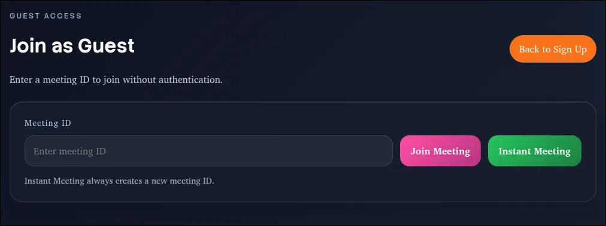 |
|  | 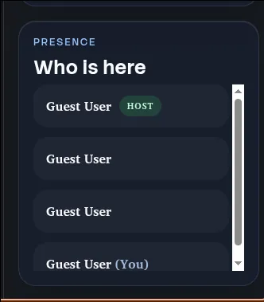 |
| 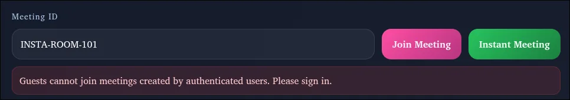 |  |

## Tech Stack 🧰

| Area | Technologies |
|---|---|
| Frontend | React, Vite, React Router DOM, CSS |
| UI & Icons | Material UI, Font Awesome |
| Backend | Node.js, Express.js |
| API Protection | Express Rate Limit |
| Real-time Communication | Socket.IO, Socket.IO Client |
| Video/Audio Calling | WebRTC, STUN/TURN ICE servers |
| Database | MongoDB, Mongoose |
| Authentication | Custom token-based authentication, Node.js Crypto |
| API Communication | Fetch API, Axios |
| Deployment | Vercel frontend, Render backend |
| Tooling | ESLint, Nodemon, npm |

## Installation ⚙️

### Prerequisites

- Node.js and npm
- MongoDB running locally or a MongoDB Atlas connection string
- A modern browser with camera, microphone, and WebRTC support

### 1. Clone the Repository

```bash
git clone https://github.com/debarghya131/InstaMeet.git
cd InstaMeet
```

### 2. Setup the Backend

```bash
cd backend
npm install
cp .env.example .env
npm run dev
```

The backend runs on:

```text
http://localhost:5000
```

### 3. Setup the Frontend

Open a new terminal from the project root:

```bash
cd frontend
npm install
cp .env.example .env
npm run dev
```

The frontend runs on:

```text
http://localhost:5173
```

### 4. Open the App

Visit [http://localhost:5173](http://localhost:5173), create an account or
join as a guest, then create or join a meeting room. 🎉

## Environment Variables 🔐

Create `.env` files inside both the `backend` and `frontend` folders.

### Backend `.env`

```env
PORT=5000
NODE_ENV=development
MONGODB_URL=mongodb://127.0.0.1:27017/instameet
CORS_ORIGIN=http://localhost:5173
JWT_SECRET=replace-with-a-long-random-secret
TRUST_PROXY=1
```

| Variable | Description |
|---|---|
| `PORT` | Backend server port |
| `NODE_ENV` | Runtime environment |
| `MONGODB_URL` | MongoDB connection string |
| `CORS_ORIGIN` | Allowed frontend origin |
| `JWT_SECRET` | Secret key used for signing auth tokens |
| `TRUST_PROXY` | Proxy count for deployed platforms such as Render |

### Frontend `.env`

```env
VITE_API_BASE_URL=http://localhost:5000
VITE_SOCKET_SERVER_URL=http://localhost:5000
VITE_STUN_URLS=stun:stun.l.google.com:19302,stun:stun1.l.google.com:19302,stun:stun2.l.google.com:19302
VITE_TURN_URLS=turn:your-turn-host:3478?transport=udp,turn:your-turn-host:3478?transport=tcp
VITE_TURN_USERNAME=your-turn-username
VITE_TURN_PASSWORD=your-turn-password
VITE_WEBRTC_ICE_TRANSPORT_POLICY=all
```

| Variable | Description |
|---|---|
| `VITE_API_BASE_URL` | Backend REST API base URL |
| `VITE_SOCKET_SERVER_URL` | Socket.IO backend URL |
| `VITE_STUN_URLS` | Comma-separated STUN server URLs |
| `VITE_TURN_URLS` | Comma-separated TURN server URLs |
| `VITE_TURN_USERNAME` | TURN server username |
| `VITE_TURN_PASSWORD` | TURN server password |
| `VITE_WEBRTC_ICE_TRANSPORT_POLICY` | WebRTC ICE policy, usually `all` or `relay` |

For local development, public STUN servers are usually enough. For production,
configure a TURN server for more reliable audio and video across restricted
networks.

## Challenges Faced 🚧

- Managing WebRTC offer/answer and ICE candidate flow for real-time calls.
- Keeping Socket.IO room state accurate during joins, leaves, refreshes, and
  disconnects.
- Handling guest access, authenticated meeting ownership, and host cleanup.
- Making camera, microphone, screen sharing, CORS, and production routing behave
  reliably.

## Solutions Implemented ✅

- Used Socket.IO for WebRTC signaling, chat, presence, and participant updates.
- Added separate authenticated and guest meeting flows with access rules.
- Added host-aware room ending, meeting cleanup, and temporary disconnect grace
  handling.
- Added media error fallbacks, STUN/TURN configuration, CORS settings, and
  Vercel SPA rewrites.

## Testing 🧪

The project currently focuses on manual testing and build/lint verification.
Dedicated automated tests can be added in a future version.

### Frontend Checks

```bash
cd frontend
npm run lint
npm run build
```

### Backend Checks

```bash
cd backend
npm start
```

### Manual Test Scenarios

- Register a new user and log in.
- Create a meeting as an authenticated user.
- Join an existing meeting from another browser tab or device.
- Create and join a guest meeting.
- Verify that guests cannot join authenticated-user meetings.
- Test microphone mute and unmute.
- Test camera on and off.
- Test screen sharing.
- Send and receive real-time chat messages.
- Copy and share the room ID.
- Leave a room as a participant.
- End a meeting as the host.
- Refresh `/room/:roomId` in production and confirm the route still loads.

## Optimization ⚡

- Optimized landing assets with WebP images and an SVG favicon.
- Used Vite production builds for bundling and asset hashing.
- Cleaned up media tracks, peer connections, and empty room state.
- Added responsive layouts and SPA route rewrites for deployed pages.

## Security 🔒

- Passwords are salted and hashed before storage.
- Protected APIs use bearer-token authentication.
- Backend requires `JWT_SECRET` and restricts origins with `CORS_ORIGIN`.
- Rate limiting protects login, registration, meeting creation, and public APIs.
- Guest users are blocked from authenticated-user rooms.
- Secrets stay in `.env` files and are excluded from git.

## Future Improvements 🚀

- Add automated tests and CI/CD.
- Add meeting scheduling, invites, and persistent chat history.
- Add waiting room, co-host, and host moderation controls.
- Add recording, file sharing, and meeting analytics.
- Add Docker support for easier setup.

## Learnings 📚

- WebRTC signaling, ICE candidates, and peer-to-peer media flow.
- Socket.IO room events for chat, presence, and meeting state.
- Browser media APIs for camera, microphone, and screen sharing.
- Full-stack auth, MongoDB modeling, CORS, deployment, and responsive UI.

## Author Details 👨‍💻

### Be My Friend 🤝

I always like to make new friends. Follow me on:

[](https://www.linkedin.com/in/debarghya-bandyopadhyay-953b02400?utm_source=share_via&utm_content=profile&utm_medium=member_android)

[](https://x.com/debarghya131)

[](https://github.com/debarghya131)

[](https://portfolio.debarghya.org)

[](mailto:debarghyabandyopadhyay191@gmail.com)

**Author:** Debarghya Bandyopadhyay
